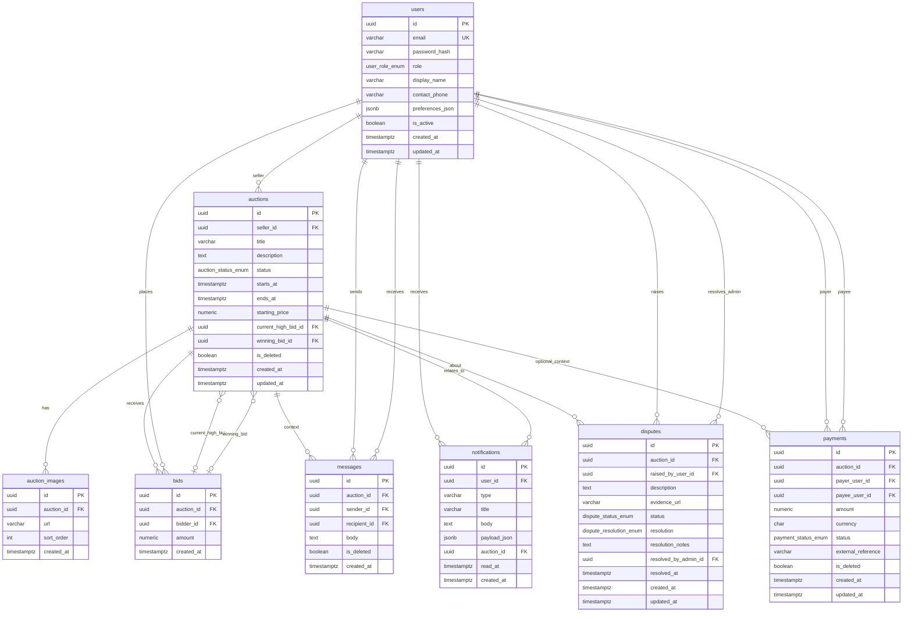
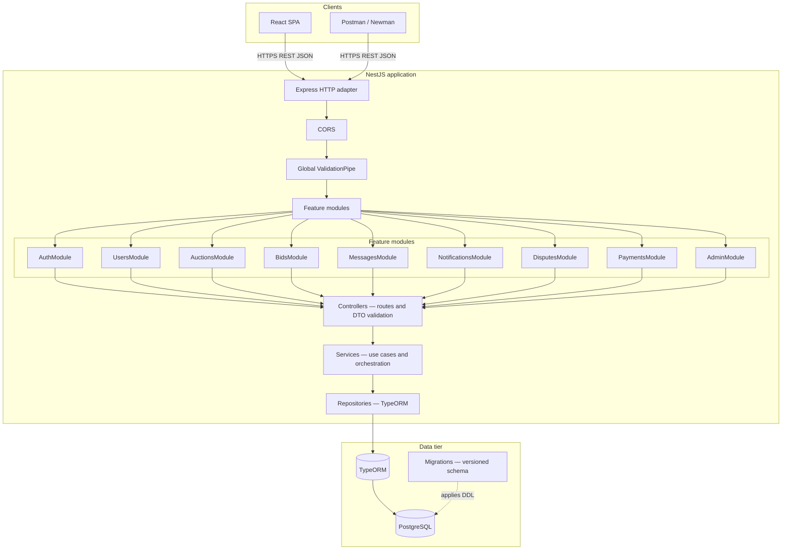
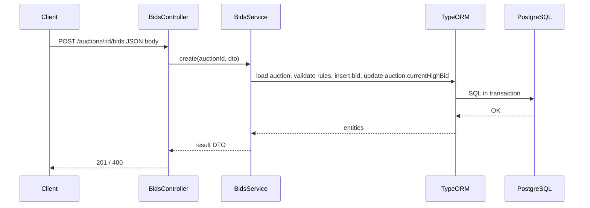

# Rare Collectible Auction House — architecture and data model

This document summarizes how the NestJS backend is structured and how domain entities relate in PostgreSQL (TypeORM).

---

## 1. Entity–relationship diagram (ERD)

Core rule: **bids** belong to one **auction** and one **bidder** (**user**). An **auction** optionally points to a single row in **bids** for the current highest offer and (when ended) the winning bid—those are foreign keys on `auctions`, not separate tables.

**Cardinality notes**

- One **user** can sell many **auctions**; each **auction** has exactly one **seller**.
- One **auction** has many **bids**; each **bid** belongs to one **auction** and one **bidder**.
- **current_high_bid_id** and **winning_bid_id** on **auctions** are optional references into **bids** (same table as normal bids).
- **messages** and **notifications** tie communication and alerts to **users** and optionally to an **auction**.
- **disputes** link an **auction**, the **user** who raised them, and optionally an **admin** who resolved them.
- **payments** link **payer** and **payee** users and may reference an **auction** when the payment is sale-related.

---

## 2. Application architecture (logical view)

The system is a **single backend** (REST JSON) intended to be used by a **separate frontend** (e.g. React). Persistence is **PostgreSQL** via **TypeORM**; HTTP is served by **NestJS on Express**.

**Layer roles (MVC-style mapping for coursework)**

| Layer in Nest           | Typical MVC analogy                   | Responsibility                                              |
| ----------------------- | ------------------------------------- | ----------------------------------------------------------- |
| **Controller**          | Controller / “view” boundary for HTTP | HTTP methods, status codes, DTOs, routing                   |
| **Service**             | Business / application logic          | Rules (e.g. bid validity), orchestration                    |
| **Entity / Repository** | Model + data access                   | Rows in PostgreSQL, queries, transactions                   |
| **Module**              | Packaging                             | Wires controllers, services, and `TypeOrmModule.forFeature` |

**Cross-cutting (current or planned)**

- **ConfigModule**: environment-driven DB host, name, credentials, optional `DB_MIGRATIONS_RUN`.
- **Auth**: JWT/guards (stub today) will sit between HTTP and controllers for protected routes.
- **Admin**: same API process, **role** on **users** distinguishes administrators for moderation and dispute resolution.

---

## 3. Request path (example: place a bid)

---

## 4. Where this lives in the repo

| Concern                  | Location                                                    |
| ------------------------ | ----------------------------------------------------------- |
| TypeORM entities         | `src/database/entities/`                                    |
| Enums                    | `src/database/enums/`                                       |
| Migrations               | `src/database/migrations/`                                  |
| CLI `DataSource`         | `src/database/data-source.ts`                               |
| Nest TypeORM root config | `src/database/typeorm-root-options.ts`, `src/app.module.ts` |
| REST modules             | `src/modules/*`                                             |

If your IDE or Git host does not render Mermaid, paste the fenced blocks into [Mermaid Live Editor](https://mermaid.live/) or use a VS Code Mermaid preview extension.
